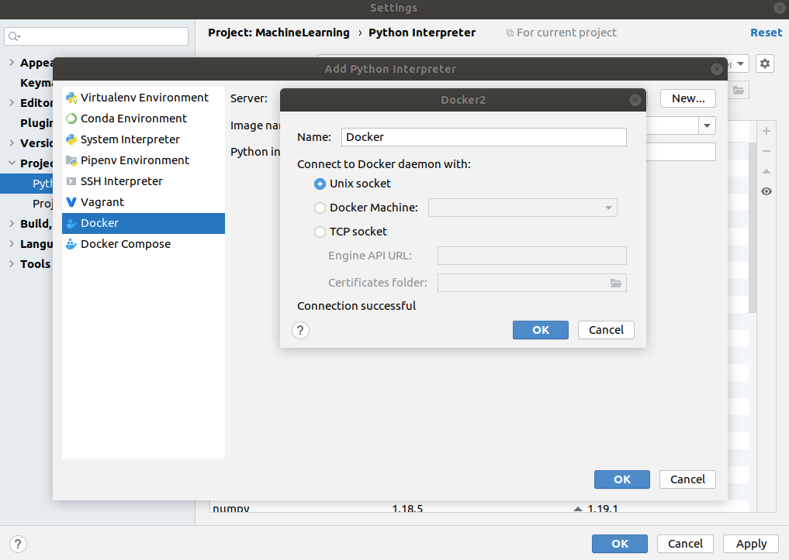
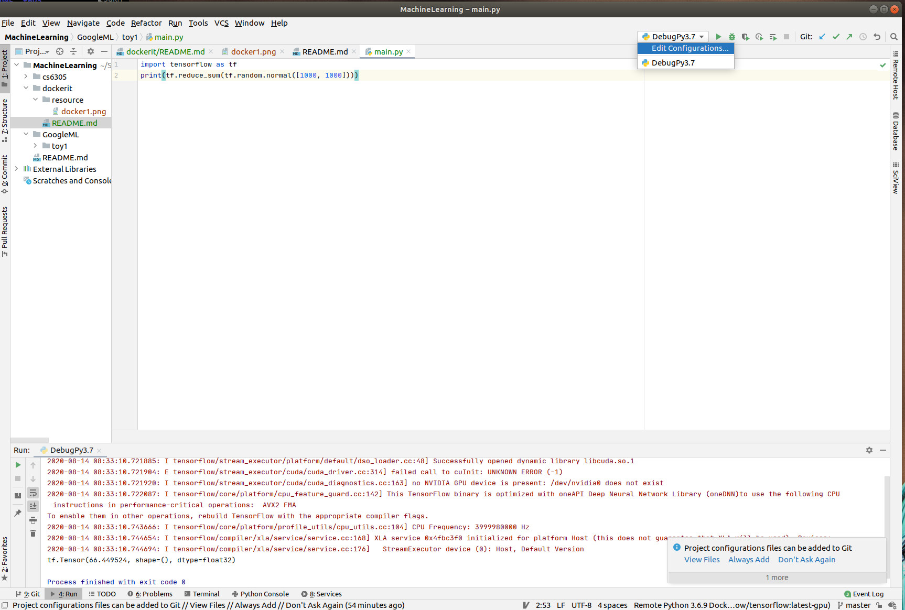

# Google Tenforflow toturial
Tensorflow official [installation tutorial](https://www.tensorflow.org/install/docker). 

Docker uses containers to create virtual environments that isolate a TensorFlow installation from the rest of the system. TensorFlow programs are run within this virtual environment that can share resources with its host machine (access directories, use the GPU, connect to the Internet, etc.). The TensorFlow Docker images are tested for each release.

Docker is the easiest way to enable TensorFlow GPU support on Linux since only the [NVIDIA® GPU driver](https://github.com/NVIDIA/nvidia-docker/wiki/Frequently-Asked-Questions#how-do-i-install-the-nvidia-driver) is required on the host machine (the NVIDIA® CUDA® Toolkit does not need to be installed).

## Issues and Solutions

## Step 1. Install NVDIA Driver
The recommended way is to use your [package manager](https://docs.nvidia.com/cuda/cuda-installation-guide-linux/index.html#package-manager-installation) and install the cuda-drivers package (or equivalent).
When no packages are available, you should use an official "runfile".

#### About post-installation action in the [instruction ](https://docs.nvidia.com/cuda/cuda-installation-guide-linux/index.html#post-installation-actions)
It will create an symbolic link '/usr/local/cuda' to the newest installed tensorflow path '/usr/local/cuda-11.0'. In my own system, the enviroment have been set. No action need to perform although it is required in the instruction. 

Check the CUDA Enviroment:
```
${PATH} | grep cuda
```
 
## Step 2. Install NVDIA Container Toolkit 

Varify the installation of the NVDIA Container Toolkit
```
docker run --gpus all --rm nvidia/cuda nvidia-smi
```

### Test NVDIA Container Toolkit error
##### Error printout:
```
stderr: nvidia-container-cli: initialization error: nvml error: driver/library version mismatch
```
##### Solution:

The NVDIA Driver although is installed. The NVDIA Driver is currently not working properly. Reboot the computer will solve this issue. 

## Step 3. Pull the Tensorflow Image 


# Connect Pycharm to Tensorflow [Docker Container](https://timodenk.com/blog/connecting-pycharm-to-a-tensorflow-docker-container/#:~:text=Open%20the%20PyCharm%20preferences%20and,error%20should%20now%20be%20gone.)


[Timo Denk's Tutorial](https://timodenk.com/blog/connecting-pycharm-to-a-tensorflow-docker-container/#:~:text=Open%20the%20PyCharm%20preferences%20and,error%20should%20now%20be%20gone.)


## 1. Create Docker Interprater

Open the PyCharm preferences and navigate to “Project: <project-name>” > “Project Interpreter”. Click on “Add…”

Or

File ->  Setting -> “Project: <project-name>” > “Project Interpreter”. Click on “Add…”


Select “Docker” and go with the image “tensorflow/tensorflow”.


If the [Docker] term does not persent. Need to create a new docker server by click ['New']



Add a new Python run/debug configuration




Done!!!
